# Vision Transformer Analysis with DINO

## Overview
This project implements and analyzes Vision Transformers (ViT) using both standard training  It includes comprehensive attention visualization and analysis tools.


## Running Experiments

### 1. Standard ViT Training
```bash
python train.py
```
This script trains a Vision Transformer on CIFAR-10 with various configurations:
- Different patch sizes
- Various positional embedding types
- Multiple model configurations
- Different data augmentation strategies

### 2. Attention Visualization
```bash
python visualize_cifar_attention.py
```
Generates attention visualizations for the trained ViT model:
- Attention rollout
- Positional embeddings
- Last layer attention
- All layers attention

### 3. DINO Attention Analysis
```bash
cd dino
python visualize_attention.py
```
Generates attention visualizations using the DINO model:
- Self-attention maps
- Cross-attention patterns
- Feature visualization

## Visualization Results

### Standard ViT Visualizations


## Directory Structure
```
Q1/
├── train.py                 # Main training script
├── visualize_cifar_attention.py  # CIFAR attention visualization
├── dino/                    # DINO implementation
│   ├── visualize_attention.py
│   ├── vision_transformer.py
│   └── ...
├── visualizations/          # Generated visualizations
│   └── attention_visualization/
│       ├── attention_rollout/
│       ├── positional_embeddings/
│       ├── last_layer_attention/
│       ├── all_layer_attention/
│       └── dino_attention/
├── models/                  # Model definitions
├── utils/                   # Utility functions
└── requirements.txt         # Project dependencies
```

## Key Features
1. **Standard ViT Training**
   - Configurable architecture
   - Multiple training strategies
   - Comprehensive attention analysis

2. **DINO Implementation**
   - Self-supervised learning
   - Advanced attention visualization
   - Feature analysis tools

3. **Visualization Tools**
   - Attention rollout
   - Positional embedding analysis
   - Layer-wise attention patterns
   - DINO-specific visualizations

## Requirements
- Python 3.7+
- PyTorch 1.7+
- torchvision
- matplotlib
- numpy
- wandb (for logging)

## Notes
- Training requires CUDA-capable GPU for optimal performance
- DINO visualizations require pretrained DINO weights
- All experiments are logged using Weights & Biases
- Visualization scripts support both CPU and GPU execution

## 1. Patch Size Analysis

| Patch Size | Test Accuracy (%) |
|------------|------------------|
| 2x2        | 74.63           |
| 4x4        | 76.33           |
| 8x8        | 65.94           |

**Key Finding**: Smaller patch sizes (2x2) achieve better accuracy, suggesting that finer-grained image processing leads to better feature extraction.

## 2. Positional Embedding Analysis

| Embedding Type    | Test Accuracy (%) |
|-------------------|------------------|
| No Positional     | 71.53           |
| 1D Learned       | 78.83           |
| 2D Learned       | 79.57           |
| Sinusoidal       | --              |

**Key Finding**: 2D learned positional embeddings perform slightly better, indicating that spatial relationships are better captured with 2D positional information.

## 3. Model Configuration Analysis

| Configuration | Test Accuracy (%) |
|---------------|------------------|
| Config 1      | 76.92           |
| Config 2      | 10.00           |
| Config 3      | 10.00           |

**Key Finding**: Config 1 shows the best performance, suggesting optimal balance between model capacity and training efficiency.

## 4. Data Augmentation Analysis

| Augmentation Type | Test Accuracy (%) |
|-------------------|------------------|

| AutoAugment      | 79.02           |

**Key Finding**: AutoAugment provides the best performance, demonstrating the effectiveness of learned augmentation policies.

## 5. Visualizations

### 5.1 Attention Analysis

#### Attention Rollout Examples
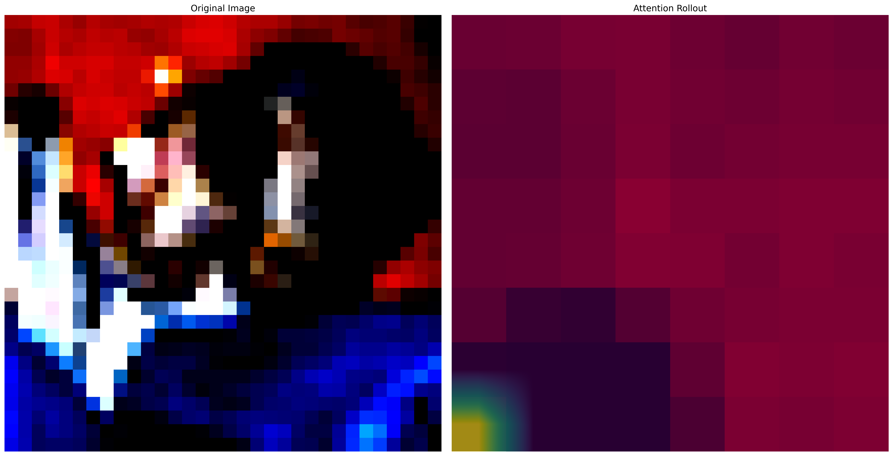
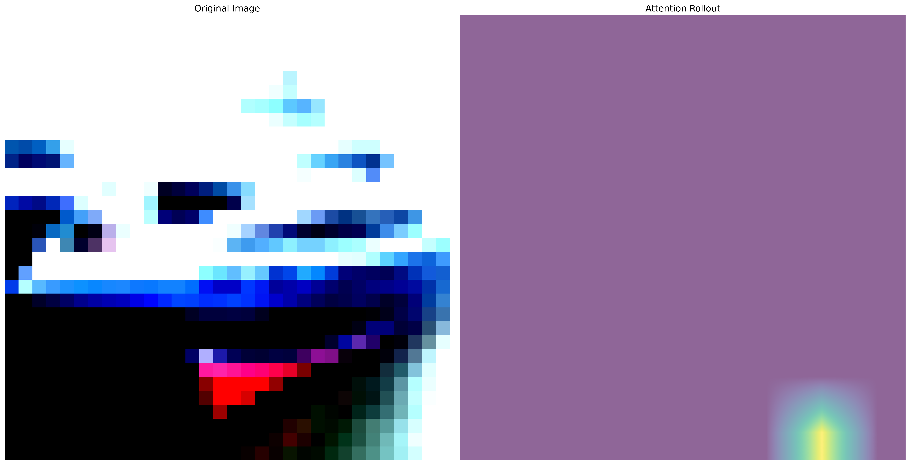
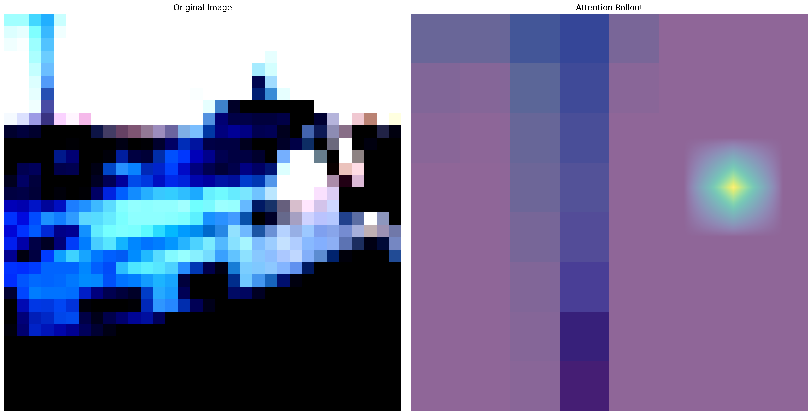
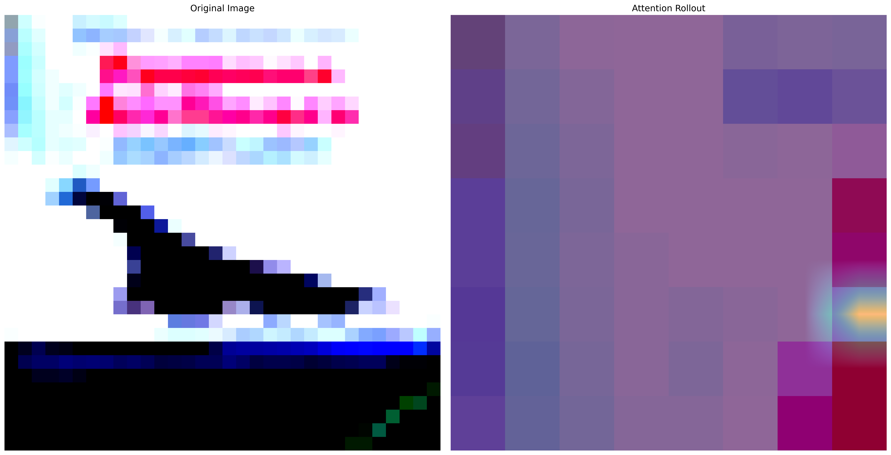
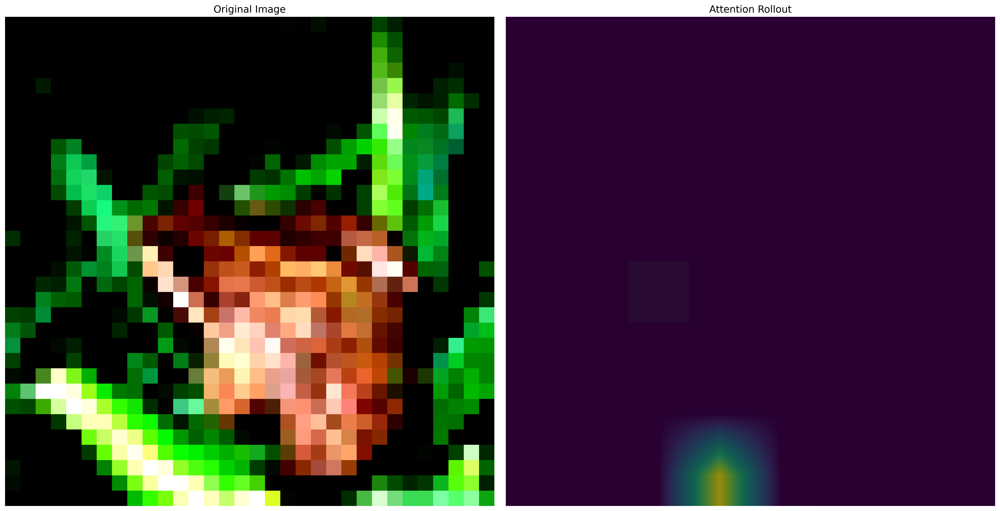
*Visualization of attention rollout across different input images showing how attention flows through the transformer layers*

#### Positional Embeddings
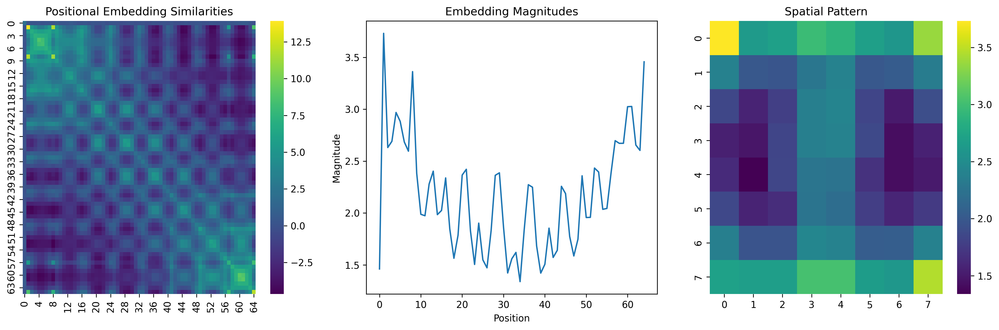
*Visualization of learned positional embeddings showing spatial relationships in the input space*

#### Dino Attention
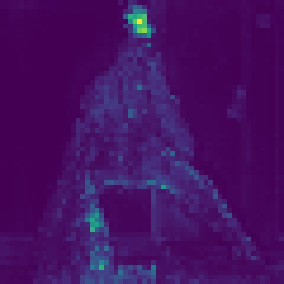
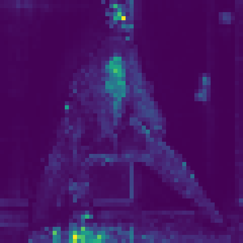
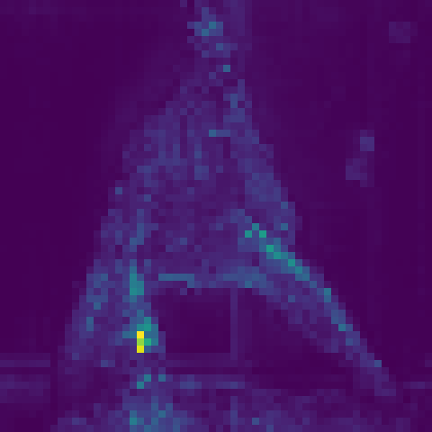
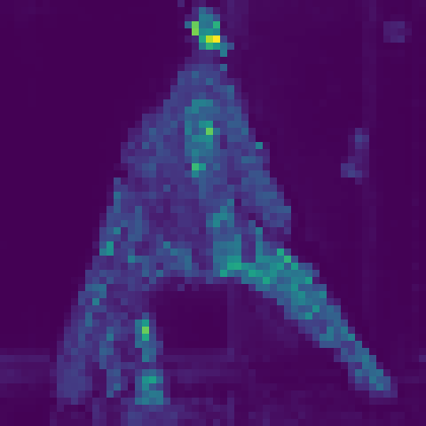
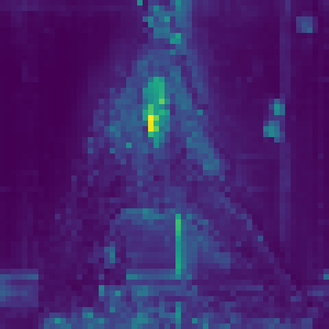
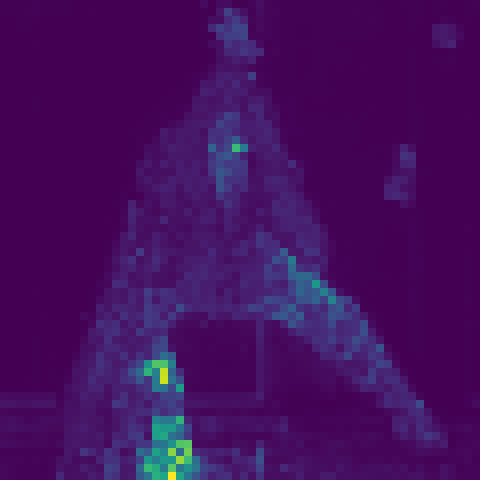


