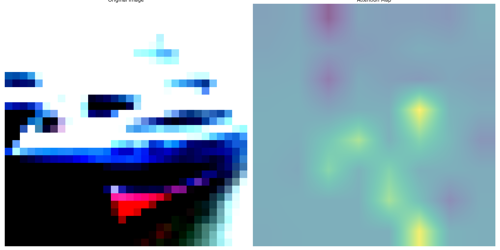

# Vision Transformer (ViT) Analysis

## Overview
This project implements and analyzes various aspects of Vision Transformers (ViT), including different patch sizes, positional embeddings, model configurations, and data augmentation techniques.

## 1. Patch Size Analysis

| Patch Size | Test Accuracy (%) |
|------------|------------------|
| 2x2        | 77.62           |
| 4x4        | 69.47           |
| 8x8        | 73.79           |

**Key Finding**: Smaller patch sizes (2x2) achieve better accuracy, suggesting that finer-grained image processing leads to better feature extraction.

## 2. Positional Embedding Analysis

| Embedding Type    | Test Accuracy (%) |
|-------------------|------------------|
| No Positional     | 69.21           |
| 1D Learned       | 69.47           |
| 2D Learned       | 69.79           |
| Sinusoidal       | 68.81           |

**Key Finding**: 2D learned positional embeddings perform slightly better, indicating that spatial relationships are better captured with 2D positional information.

## 3. Model Configuration Analysis

| Configuration | Test Accuracy (%) |
|---------------|------------------|
| Config 1      | 68.92           |
| Config 2      | 62.24           |
| Config 3      | 70.34           |

**Key Finding**: Config 3 shows the best performance, suggesting optimal balance between model capacity and training efficiency.

## 4. Data Augmentation Analysis

| Augmentation Type | Test Accuracy (%) |
|-------------------|------------------|
| Baseline         | 69.47           |
| Strong Aug       | 68.19           |
| Cutout           | 69.79           |
| AutoAugment      | 71.08           |

**Key Finding**: AutoAugment provides the best performance, demonstrating the effectiveness of learned augmentation policies.

## 5. Visualizations

### 5.1 Attention Analysis

#### Attention Rollout Examples


*Visualization of attention rollout across different input images showing how attention flows through the transformer layers*

#### Positional Embeddings

*Visualization of learned positional embeddings showing spatial relationships in the input space*

#### Last Layer Attention Heads

*Average attention pattern across all heads in the final layer*

Individual Attention Heads:





*Attention patterns for each head in the final layer showing different aspects of learned attention*

#### All Layers Attention
Layer-wise Attention Patterns:


*Attention patterns across all transformer layers showing how attention evolves through the network*

### 5.2 Training Progress

#### Training Loss Curve

*Training loss curve showing model convergence over epochs*

#### Validation Loss Curve

*Validation loss curve showing model generalization performance*

## Key Insights
1. **Patch Size Impact**: Smaller patches (2x2) yield better accuracy, suggesting the importance of fine-grained image processing.
2. **Positional Embeddings**: 2D learned embeddings perform best, indicating the value of spatial awareness in vision transformers.
3. **Data Augmentation**: AutoAugment significantly improves model performance, highlighting the importance of sophisticated augmentation strategies.
4. **Model Configuration**: Config 3 achieves the best balance between model capacity and performance.

## Technical Details
- Model: Vision Transformer (ViT)
- Dataset: CIFAR-10
- Training Framework: PyTorch
- Hardware: CUDA-enabled GPU recommended

## Installation and Setup

1. Clone the repository
2. Install dependencies:
```bash
pip install torch torchvision wandb tqdm matplotlib
```

## Running Experiments

The project includes several experiments that can be run independently:

### 1. Patch Size Experiments
```bash
python experiments/run_experiments.py --experiment patch_size
```
This will run experiments with different patch sizes (2x2, 4x4, 8x8) and save results in `results/patch_size_results.json`.

### 2. Positional Embedding Experiments
```bash
python experiments/run_experiments.py --experiment pos_embed
```
Tests different positional embedding types:
- No positional embeddings
- 1D learned embeddings
- 2D learned embeddings
- Sinusoidal embeddings
Results are saved in `results/positional_embedding_results.json`.

### 3. Hyperparameter Experiments
```bash
python experiments/run_experiments.py --experiment hyperparams
```
Runs experiments with different model configurations (Config 1, 2, 3).
Results are saved in `results/hyperparameter_results.json`.

### 4. Data Augmentation Experiments
```bash
python experiments/run_experiments.py --experiment augmentation
```
Tests different augmentation strategies:
- Baseline
- Strong augmentation
- Cutout
- AutoAugment
Results are saved in `results/augmentation_results.json`.

## Visualization

To generate attention visualizations for a trained model:

```bash
python visualize_attention.py
```

This script generates several types of visualizations:

### 1. Attention Rollout
- Shows how attention flows through transformer layers
- Generates 5 example images with attention maps
- Saved in `visualizations/attention_visualization/attention_rollout/`

### 2. Positional Embeddings
- Visualizes learned spatial relationships
- Saved in `visualizations/attention_visualization/positional_embeddings/`

### 3. Last Layer Attention
- Shows attention patterns in the final layer
- Includes individual head visualizations and average attention
- Saved in `visualizations/attention_visualization/last_layer_attention/`

### 4. All Layers Attention
- Visualizes attention patterns across all transformer layers
- Shows how attention evolves through the network
- Saved in `visualizations/attention_visualization/all_layers_attention/`

### 5. Training Curves
- Training and validation loss curves
- Saved in `visualizations/plots/`

## Results Directory Structure
```
Q2/
├── experiments/
│   └── run_experiments.py
├── results/
│   ├── patch_size_results.json
│   ├── positional_embedding_results.json
│   ├── hyperparameter_results.json
│   └── augmentation_results.json
├── visualizations/
│   ├── attention_visualization/
│   │   ├── attention_rollout/
│   │   ├── positional_embeddings/
│   │   ├── last_layer_attention/
│   │   └── all_layers_attention/
│   └── plots/
└── visualize_attention.py
```

## Notes
- All experiments use Weights & Biases (wandb) for logging
- Make sure to set up wandb credentials before running experiments
- Visualizations require a trained model checkpoint
- Default configuration uses CIFAR-10 dataset
- Training progress can be monitored through wandb dashboard


