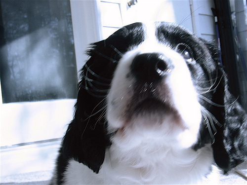
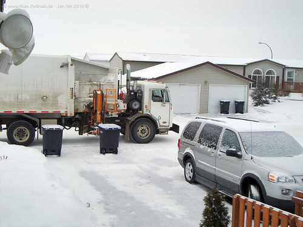

# Computer Vision Analysis: ResNet-50 and CLIP Comparison

## 1. Architecture Comparison: Standard ResNet-50 vs CLIP ResNet-50

### Standard ResNet-50
- Ends with a simple Linear layer (in_features=2048, out_features=1000)
- Maps directly from 2048 features to 1000 class outputs
- Optimized for image classification tasks

### CLIP ResNet-50
- Ends with an AttentionPool2d module containing multiple projection layers
- Uses self-attention mechanism (k_proj, q_proj, v_proj)
- Final output dimension is 1024 (c_proj) rather than 1000
- Designed to project images into a joint embedding space with text

**Key Difference**: CLIP's vision encoder uses attention pooling to create embeddings that align with text in a shared multimodal space, while standard ResNet-50 is focused on classification into predefined categories.

## 2. ImageNet Label Hierarchy

ImageNet's labels follow a hierarchical structure based on WordNet, a lexical database that groups words into synsets (synonym sets).

### Structure
- Broad categories (e.g., "Animal," "Vehicle")
- Divided into finer subcategories

**Example Hierarchy**:
```
Animal → Chordate → Mammal → Dog → Labrador Retriever
Vehicle → Wheeled Vehicle → Car → Sports Car
```

### Synset Definition
A synset (synonym set) is a group of synonyms representing a distinct concept in WordNet. Each synset has:
- A unique ID
- A definition (gloss)
- Synonyms (e.g., "dog, domestic dog, Canis familiaris")

## 3. Visual Differences Within Synsets

### 1. Intra-Class Appearance Variation
- Shape, Size, and Color differences
- Example: "Labrador Retriever" includes black, yellow, and chocolate Labradors
- Example: "Sports Car" includes Ferraris (red) and Porsches (silver)

### 2. Viewpoint and Pose Differences
- Camera Angle & Object Orientation variations
- Example: "dining table" from top-down vs side view
- Example: "cat" in sitting, standing, or lying positions

### 3. Background and Occlusion Variability
- Cluttered Backgrounds & Partial Visibility
- Example: "Coffee mug" on table vs held by hand
- Example: "Airplane" in sky vs partially visible behind building

## 4. CLIP vs ImageNet Pretrained RN50 Performance. Two images works well with CLIP but not with ImageNet pretrained RN50

### Example Images
1. English Springer
   
   *Image showing an English Springer dog*

2. Garbage Truck
   
   *Image showing a garbage truck*

**Analysis**: CLIP performs better due to its ability to leverage broader contextual information and scene understanding from its image-text pair training, while ImageNet-trained ResNet-50 focuses solely on object recognition.

## 5. FP32 vs FP16 Model Comparison

### Performance Metrics
- FP32 Mean time: 8.90ms ± 0.14ms
- FP16 Mean time: 9.57ms ± 0.09ms
- Speedup: 0.93x

### Prediction Accuracy
- Maximum difference across all images: ~0.006 (less than 1%)
- Mean differences: 0.000000-0.000016
- FP16 model maintains nearly identical prediction quality to FP32 model

### Memory Usage
Detailed memory usage statistics are available in the original analysis for both FP32 and FP16 models.

## Conclusion
The analysis demonstrates the architectural differences between standard ResNet-50 and CLIP's vision encoder, highlighting their respective strengths in classification and multimodal understanding. The comparison of FP32 and FP16 models shows that reduced precision maintains model performance while potentially offering memory efficiency benefits.